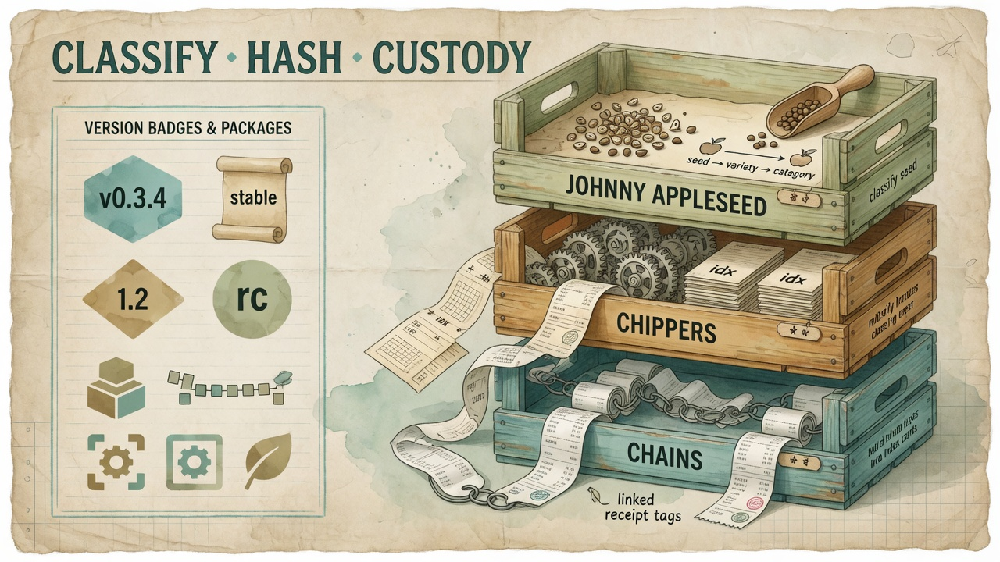

# Johnny Appleseed · C.H.I.P.P.E.R.S. · C.H.A.I.N.S.

<p align="center">
  
</p>

<p align="center">
  <strong>Public alpha intent</strong> · parallel design under active lab development · not a finished product<br />
  <em>We are publishing the idea so it can be scrutinized — not pretending the code already won.</em>
</p>

<p align="center">
  <a href="#the-ask-socratic-and-sincere"></a>
  <a href="LICENSE"></a>
  <a href="INDEX.md"></a>
</p>

---

## Hey — let’s talk for a second

Care work, creative work, and “I already downloaded that twice” work all produce the same quiet mess:

**files you already have** — scans, PDFs, exports, model weights, tool installs, chat dumps — sitting in more than one place, with no honest story about *which copy is the original*, *whether the bytes match*, or *who touched them when*.

Most “AI data platforms” want to crawl the open web.  
This sketch does the opposite.

It asks: **if the materials are already in your hands, how do you classify them, hash them safely, and keep a simple custody trail without marketing a receipt log as a court seal?**

That is the whole trio:

| Name | Plain job | One-line honesty |
|------|-----------|------------------|
| **Johnny Appleseed** | Figure out *what kind of thing* a file is **before** you spend energy parsing it | No open-web crawl. Operator-owned materials only. |
| **C.H.I.P.P.E.R.S.** | Content **H**ashing, **I**nspection, **P**arsing, **P**rovenance, **E**xtraction, **R**etrieval, **S**implification | Unknown binaries → metadata only. We do not “open everything and hope.” |
| **C.H.A.I.N.S.** | Custody History Assurance Integrated Network System | **Tamper-evident bookkeeping** — not blockchain cosplay, not legal immutability, not identity proof. |

<p align="center">
  
</p>

---

## The ask (socratic, and sincere)

This repository is **public alpha *intent***:

- Lab work continues in **parallel** (other private/public surfaces in the M.A.N.A.G.E.R. family).
- Late **July 2026** published the first modular sketch (docs + process templates).
- **Tonight’s flip** (2026-08-06) cleans that release narrative and invites **public scrutiny** — the kind that is semantic, sensible, and a little Socratic.

**Will this trio fly?**

We do not know yet. That is why it is public.

If you are a systems person, a caregiver-engineer, a storage nerd, or someone who has been burned by “AI pipelines” that quietly rewrite originals: read the design, poke holes, argue about the seam, tell us where the language overpromises.

### What “success” looks like for this alpha

Not stars. Not hype.

1. People can restate the three layers in their own words without inventing features we never claimed.  
2. People stop conflating **file-hash reclaim** with **block-level storage reclaim** (see [docs/DEDUP_LAYERS.md](docs/DEDUP_LAYERS.md)).  
3. People treat C.H.A.I.N.S. as receipts, not religion.  
4. If the design is wrong, the public record shows *why* — so the next cut is smarter.

---

## What it helps “deduplicate” (and what it does not)

### Helps (intent)

- **Byte twins** of documents, weights, and exports you already hold (content-hash ladder: size → sample → SHA-256).  
- **Structural clutter** (duplicate install roots, husks, path chaos) — report first, delete never automatic.  
- **Rendition sprawl** (OCR text, cleaned markdown, exports) while **never overwriting** `00_original`.  
- **Honest catalogs** of “what is on the pool” without agents running unbounded filesystem walks.

### Does *not* (non-goals)

- Replace **bees** / filesystem-level extent dedupe (different layer — physical sharing).  
- Auto-delete anything without a verification manifest and a human.  
- Scrape the open web for “more data.”  
- Certify legal compliance, forensics, or identity.

Process truth from real lab ops (abstracted, no private hosts): [docs/PROCESS_TEMPLATES.md](docs/PROCESS_TEMPLATES.md) · Templates **A–F**.

---

## Architecture sketch (alpha)

```text
materials you already hold
        │
        ▼
┌───────────────────┐
│  Johnny Appleseed │  classify · scope · consent · no crawl
└─────────┬─────────┘
          ▼
┌───────────────────┐
│  C.H.I.P.P.E.R.S. │  hash · inspect · safe parse · index records
└─────────┬─────────┘
          ▼
┌───────────────────┐
│     C.H.A.I.N.S.  │  append-only custody receipts (prev_hash · actor · UTC)
└─────────┬─────────┘
          ▼
   portable indexes + optional adapters
   (search store · vault · catalog — outside this seam)
```

### Module seam (interface sketch)

```python
batch = IngestionEngine().ingest(materials)
verified = IngestionEngine().verify(batch)
```

Callers acquire bytes and choose scope/consent. The engine returns artifacts, portable index documents, and optional custody receipts — **no** direct network, filesystem, or database writes inside the module itself. Adapters consume return values; they do not reach into private guts.

### Rendition contract

```text
00_original → 10_assured → 20_extracted → 30_cleaned → 40_simplified →
45_markdown → 50_accessible → 60_index → 70_exports
```

Every tier records its parent digest and transformation. Inapplicable tiers stay absent but are reported. Originals are never overwritten.

Deeper map (roles only): [docs/MANAGER_MODULE_MAP.md](docs/MANAGER_MODULE_MAP.md) · handoff map [INDEX.md](INDEX.md).

---

## Software · versioning · package-manager catalog (earmark)

This repo is **docs-first alpha**. When implementation lands, tool and OS inventory is meant to be **probed and receipted**, not silently mutated.

Staged tool record shape:

```json
{
  "tool_id": "example-cli",
  "version": "0.x.y",
  "path": "/usr/local/bin/example-cli",
  "manager": "homebrew",
  "probed_at": "2026-08-06T00:00:00Z",
  "host_role": "desk-host"
}
```

### Package managers in scope (catalog, not auto-install)

| Ecosystem | Managers / channels | Notes for this design |
|-----------|---------------------|------------------------|
| **macOS** | Homebrew, Mac App Store (report-only), `asdf` / `mise` | Prefer explicit operator approval; no silent upgrades |
| **Linux** | `apt` / `dpkg`, `dnf` / `yum`, `pacman`, **Snap**, Flatpak, AppImage | Distro policy differs; record manager + version |
| **Windows** | **winget**, **Chocolatey**, Scoop, MSIX | Same rule: probe → receipt → human apply |
| **Language** | `pip` / `uv`, `npm` / `pnpm`, `cargo`, `go`, `gem`, `composer` | Manifest scan feeds SBOM-style inspection later |
| **Containers** | Docker / Compose, Podman | Image digests + tags as version evidence |
| **GPU / AI** | CUDA toolkit (host), Ollama tags, Hugging Face repos, Comfy weight sidecars | Hash weights; never treat “latest” as provenance |
| **Download plane** | **FluxDown** (Rust multi-protocol; server + UI), optional aria2 | Prefer **nas-host-local** pulls into a staging dir, then promote + hash — not double-hop client→NFS |

Full table and earmarks: [docs/PACKAGE_MANAGER_CATALOG.md](docs/PACKAGE_MANAGER_CATALOG.md).

### Dependency / versioning principles

1. **Probe, don’t assume** — record `{tool_id, version, manager, host_role, probed_at}`.  
2. **Manifests are evidence** — `package.json`, `requirements.txt`, `go.mod`, lockfiles become indexed artifacts.  
3. **Promote with hash** — multi-GB weights land in quarantine/stage → size/hash verify → pool.  
4. **No auto system update** from this design — operator approval per host role.  
5. **Separate layers of “savings”** — content-hash candidates ≠ bees physical reclaim ([docs/DEDUP_LAYERS.md](docs/DEDUP_LAYERS.md)).

---

## Status: active parallel alpha

| Wave | When | Meaning |
|------|------|---------|
| Modular sketch | late **July 2026** | First public-facing docs cut (process templates, plain-language README). |
| **Alpha intent flip** | **2026-08-06** | Clean narrative; invite scrutiny; still **docs-first** — implementation gated. |
| Parallel lab | ongoing | Real classify/hash/custody patterns exercise in private ops; code lands when seams stabilize. |

**What ships in this git tree today:** design notes, process templates, example **indexes only** (no private paths, no weights, no PHI).  
**What does not:** production extractors, sandboxes, or a claim of completeness.

Acceptance criteria for a *real* implementation remain in the design body of [docs/](docs/) and the historical README roadmap (threat model, format matrix, custody storage, independent review). None of those are “done” because we published — publication is the question, not the answer.

---

## Where this sits in M.A.N.A.G.E.R.

PDF/OCR/receipts, local tool versioning, multi-OS package earmarks, model catalog freshen, and cited-document archival all hang off the same three layers — **classify → hash/inspect → custody receipt**. See [docs/MANAGER_MODULE_MAP.md](docs/MANAGER_MODULE_MAP.md).

Sibling public stacks (sanitized): [ai-gateway](https://github.com/the1truedan/ai-gateway).

---

## How this came to be

Care work produces *paper*: notices, letters, scans, exports. Early M.A.N.A.G.E.R. design chats kept returning to the same problem: how do you classify and hash what you **already hold**, keep a plain custody trail, and never pretend a receipt log is a court seal?

This repo is the **design sketch** for that pipeline, split out so the idea can be reviewed on its own — including by strangers who will (hopefully) tell us where it is nonsense.

**Timeline anchors:** mission pivot **13 April 2026**; monorepo coding from **June 2026**; modular public sketches late **July 2026**; alpha-intent public narrative **6 August 2026**.

---

## License

MIT — see [`LICENSE`](LICENSE).

## Non-affiliation

Independent architecture sketch. Not affiliated with, endorsed by, or sponsored by any company, product, or service referenced generically above (including package ecosystems and download managers).

---

<p align="left">
  <a href="https://linktr.ee/the1truedan"></a>
  <a href="https://ko-fi.com/the1truedan"></a>
</p>

**© 2026 M.A.N.A.G.E.R. LLC** — *prepare for the care when we cannot be there*
